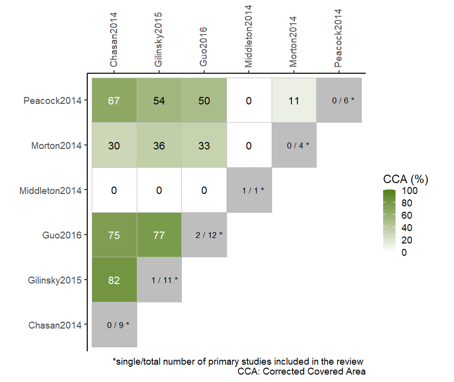

# ccaR 


## Overview

ccaR package provides functions for assessing and depicting primary study overlap across multiple reviews. The functions may be useful for methodologists and overview authors in exploring and communicating the degree of overlap in overview of reviews.

## Installation

``` r
# You can download the development version of the package from github:
devtools::install_github('thdiakon/ccaR')

```


## CCA Table


## Visualization of the pairwise CCA(%) with a heatmap



## Attribution
If package ccaR (or code from this package) is used for investigating overlap of primary studies between reviews, please cite the following manuscript:

Bougioukas KI, Vounzoulaki E, Mantsiou CD, Savvides ED, Karakosta C, Diakonidis T, et al. Methods for depicting overlap in overviews of systematic reviews: An introduction to static tabular and graphical displays. J Clin Epidemiol 2021;132:34–45. doi:https://doi.org/10.1016/j.jclinepi.2020.12.004.

